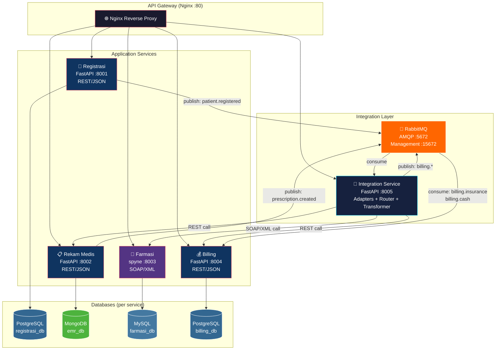
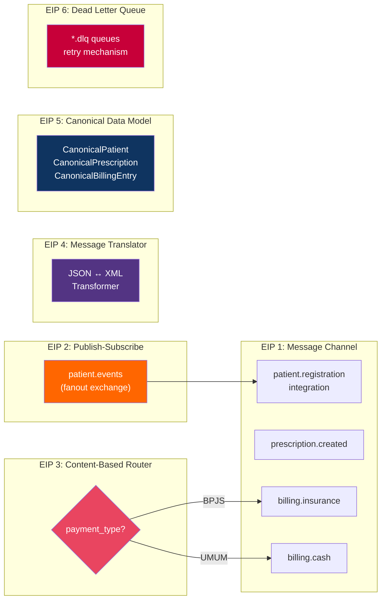
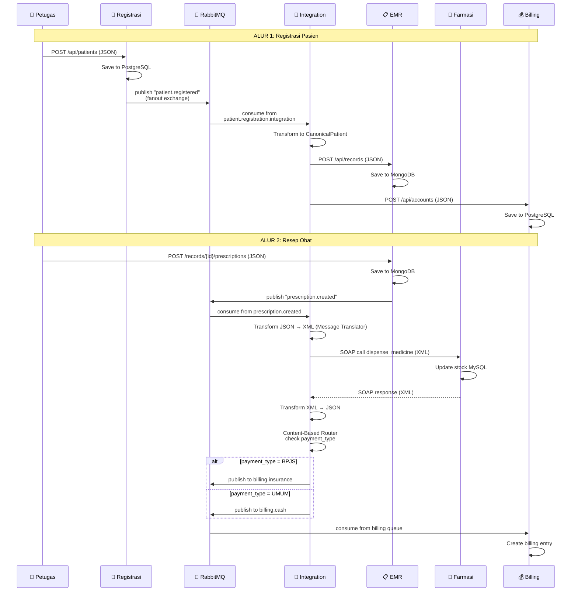
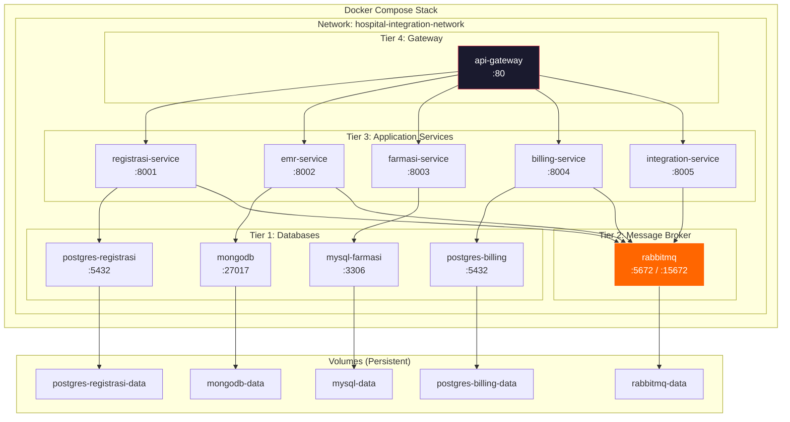

# 📐 Architecture Diagram — Hospital Integration System

## System Architecture (High-Level)

---

## Enterprise Integration Patterns (EIP) Applied

---

## Message Flow Detail

---

## Docker Compose Container Topology

